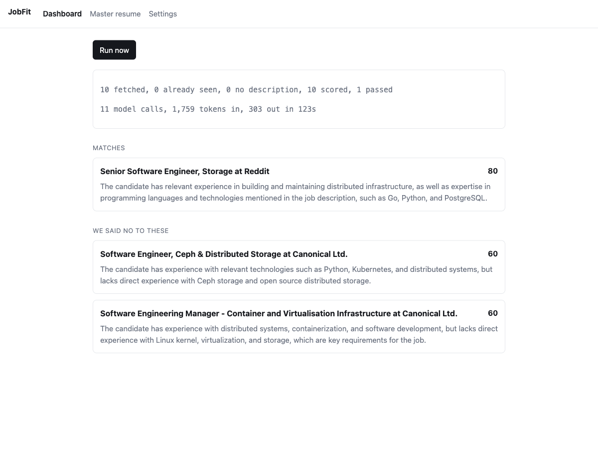

# JobFit

JobFit pulls fresh job postings every morning, scores each one against your resume and says why, writes a tailored resume for the ones worth applying to, and shows you the shortlist with a receipt of exactly what happened.



## What it does

1. Fetches job postings from the Jobicy public API on a daily schedule, or immediately when you press Run now.
2. Drops any posting without a real description **before** any model sees it, and records why it was dropped.
3. Scores each remaining posting from 0 to 100 with a one sentence reason and quoted evidence from both the job description and your resume.
4. Rewrites your master resume against the postings that clear your threshold.
5. Checks every line of every rewrite against your master resume and flags anything it cannot trace back.
6. Shows the shortlist, the reasons, and a per run receipt.

It never applies to anything. It produces drafts and a shortlist. Pressing submit stays with you.

## What makes it different from a script that calls an API

Four things, and each one exists because of a specific way this can hurt you.

**It refuses to score a posting it cannot read.** Empty descriptions are recorded as `insufficient_input` with a `NULL` score, not a zero. Zero is a judgment. `NULL` is the absence of one. A previous version of this pipeline scored postings from job titles alone when the upstream source silently returned empty descriptions, and every stage reported success. That is the failure this guards against.

**It flags resume lines it cannot trace to your master resume.** Numbers, dates, employers, and technologies in the generated resume are checked against what you actually wrote. Anything unsupported is highlighted, and **the default export leaves those lines out**. The validator is deterministic rather than a second model call, because a safety layer built from a model fails at the same moments the model fails.

**It never shows a bare empty state.** A day with no matches always says which kind of nothing it was: nothing qualified, nothing was fetched, everything was already seen, the rows came back unreadable, or the scorer failed on all of them.

**It says why something is missing.** A match with no tailored resume states whether the writer failed or the per run call cap refused it. "The writer failed" and "nothing was attempted" are different facts and are never rendered the same way.

## Run it locally

Requires Node 20 or newer and a Cloudflare account. There is no API key to obtain and no secret to configure, and this repository contains no credential file of any kind. Model calls go through Cloudflare Workers AI, which is authenticated by your account.

```bash
git clone https://github.com/hzhang23/jobfit
cd jobfit
npm install

npx wrangler login                # Workers AI authenticates through your account
npm run db:migrate:local          # creates and migrates a local D1 database

npm run build:web
npx wrangler dev
```

Open `http://localhost:8787`, paste your resume on the Master resume page, then press Run now on the Dashboard.

Running locally needs no Cloudflare resources. The database is a local SQLite file that `wrangler dev` manages. Only the model calls leave your machine.

## Run the tests

```bash
npm test
```

Two suites run, 153 tests total.

`npm run test:workers` runs 122 tests inside a real Workers runtime with a real D1 database through Miniflare. No test reaches the network: the job source takes an injected `fetch` and the model client takes an injected `AiRunner`, so there is no code path to it.

`npm run test:web` runs 31 React render tests under plain node using `react-dom/server`. They exist because two states of the interface cannot be reached by clicking through the app, so they cannot be checked by hand: a posting the scorer failed on, and a match whose tailored resume is missing. Both used to render wrong.

Two tests are worth knowing about specifically. `test/domain/provenance.test.ts` contains a test asserting a **known limitation** of the validator rather than hiding it: rewriting "was on a team" into "led a team" introduces no new tokens and is not caught. `test/workflow/run.test.ts` reproduces the original incident end to end, asserting that a run where every description is empty calls the model zero times and marks itself degraded.

## Deploy it

```bash
npx wrangler d1 create jobfit          # copy the database_id into wrangler.jsonc
npm run db:migrate:remote
npm run build:web
npx wrangler deploy
```

There are two Worker configs. `wrangler.jsonc` is the real one. `wrangler.test.jsonc` is what the test runtime loads, and it deliberately omits three bindings that the local test runtime either cannot resolve or should not need cloud credentials to start. Each exception is documented in a comment at the point of divergence. Because of that gap, `npx wrangler deploy --dry-run` is a required check: it is the only thing that proves the real config and the real entrypoint agree.

## Configuration

| Setting | Where | Default |
|---|---|---|
| Scoring model | `wrangler.jsonc` vars | `@cf/meta/llama-3.3-70b-instruct-fp8-fast` |
| Tailoring model | `wrangler.jsonc` vars | `@cf/meta/llama-3.3-70b-instruct-fp8-fast` |
| Scoring calls per run | `src/domain/quota.ts` | 10 |
| Tailoring calls per run | `src/domain/quota.ts` | 4 |
| Score threshold | Settings page | 70 |
| Postings per run | Settings page | 10 |
| Daily run hour | Settings page | 15 UTC |

The cron fires hourly and only runs users whose chosen hour matches, so one schedule covers every timezone.

There is no spend ceiling and no cost estimate, on purpose. An earlier version kept a local price table and compared an estimate against a monthly limit. A local price table is a copy of someone else's billing that goes stale without announcing it, and gating real behaviour on that estimate is the same shape as the failure this whole build exists to prevent. Cloudflare meters spend and refuses the call when the account is over quota. What is enforced locally is an exact cap on model calls per run.

## Design documents

- [Design spec](docs/superpowers/specs/2026-08-12-jobfit-design.md) covers requirements, the data model, the API, and the deep dives on each defense.
- [IMPACT Living Document](docs/IMPACT-Living-Document.md) is all five sections in one place, Intent through Cost and Constraints. The [Failure Mode Map](docs/IMPACT-Living-Document.md#section-4-accuracy-and-safety) is Section 4 and the [Tradeoffs Table](docs/IMPACT-Living-Document.md#section-5-cost-and-constraints) is Section 5.
- [Implementation plan](docs/superpowers/plans/2026-08-12-jobfit-v1.md) is the task by task plan the build followed.
