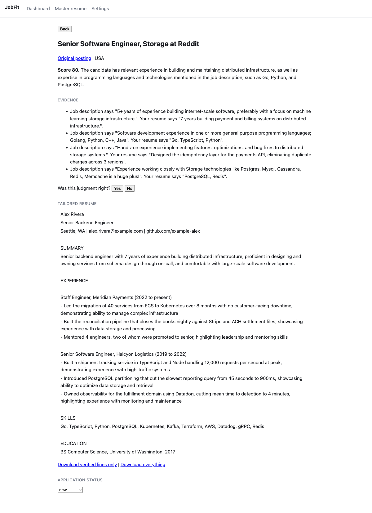

# JobFit: the tool

**Repository:** https://github.com/hzhang23/jobfit

The README is at the root of that repository. It covers what the tool does, what makes it different from a script that calls an API, how to run it locally, how to run the tests, and how to deploy it.

## What it does, in plain language

Every morning it pulls fresh job postings, scores each one against your resume and tells you why, writes a tailored resume for the ones worth applying to, and shows you the shortlist with a receipt of exactly what happened.

It never applies to anything. It produces drafts and a shortlist. Pressing submit stays with you.

## How to run it

Node 20 or newer and a Cloudflare account. There is no API key to obtain and no secret to configure, because model calls go through Cloudflare Workers AI, which is authenticated by your account.

```bash
git clone https://github.com/hzhang23/jobfit
cd jobfit
npm install

npx wrangler login                # Workers AI authenticates through your account
npm run db:migrate:local          # creates and migrates a local D1 database

npm run build:web
npx wrangler dev
```

Open `http://localhost:8787`, paste your resume on the Master resume page, then press Run now on the Dashboard.

Running locally creates no Cloudflare resources. The database is a local SQLite file. Only the model calls leave your machine.

## Screenshot: the tool running

This is a real run on my laptop, not a mockup. Ten postings fetched from the Jobicy API, ten scored by Workers AI, one cleared the threshold of 70.


Three things in that screenshot are the product-layer responses from Section 4, and they are the reason the page looks the way it does.

**The receipt line.** `10 fetched, 0 already seen, 0 no description, 10 scored, 1 passed`. The dashboard never renders a bare "no matches today". Every zero has to say which kind of zero it is, because a day with nothing good and a day with a broken fetch must not look alike. That is failure mode 3.

**The usage line.** `11 model calls, 1,759 tokens in, 303 out in 123s`. Work, not money. The app has no price table and no cost estimate, and Section 5's fourth tradeoff explains why a number it would have to guess at is worse than no number.

**"WE SAID NO TO THESE".** Two rejected postings are forced onto the screen under the accepted ones, with their scores and reasons. A drifting scorer hides in the negative class because nobody inspects what was rejected, so a sample of rejections is pushed into view whether or not you asked. That is failure mode 5.

## Screenshot: one match in detail



The score carries a stated reason and four pieces of quoted evidence, each pairing a line from the job description with a line from the resume. A bare number cannot be spot-checked. A quoted pair can.

Below the tailored resume, the export defaults to **verified lines only**. Downloading the full text is a separate, deliberate click. That is failure mode 1: every line of every generated resume is checked against the master resume by a deterministic validator, and anything it cannot trace back is excluded from the default export rather than merely highlighted.

## What the tests cover

```bash
npm test
```

162 tests across two suites. 128 run inside a real Workers runtime against a real D1 database. 34 render the React components and read the resulting HTML, which exist because two states of the interface cannot be reached by clicking through the app and therefore cannot be checked by hand.

No test reaches the network, and that is enforced by the test runtime rather than by convention.

Two tests are worth knowing about. One asserts a **known limitation** of the provenance validator instead of hiding it: rewriting "was on a team" into "led a team" introduces no new tokens and is not caught. Another reproduces the original incident end to end, asserting that a run where every job description is empty calls the model zero times and marks itself degraded.
